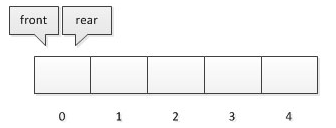
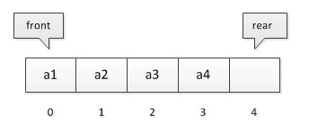
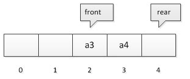
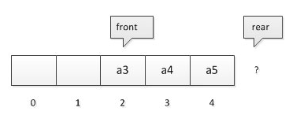
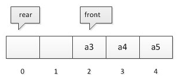
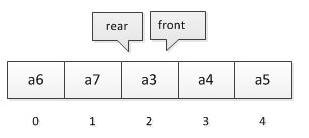
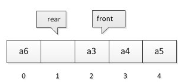
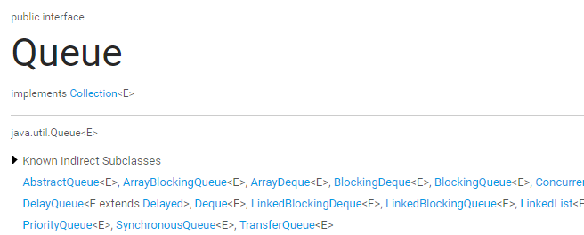
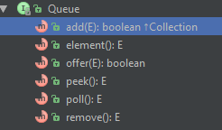

## 什么是队列

#### 队列是数据结构中比较重要的一种类型，它支持 FIFO，尾部添加、头部删除（先进队列的元素先出队列），跟我们生活中的排队类似。

#### 队列有两种：

- 单队列

- 循环队列

  #### 单队列就是常见的队列, 每次添加元素时，都是添加到队尾：

  以数组实现的队列为例，初始时队列长度固定为 4，font 和 rear 均为 0：

  

  每添加一个元素，rear 后移一位。当添加四个元素后， rear 到了索引为 4 的位置：

  

  这时 a1,a2 出队，front 后移动到 2：

  

  这时想要再添加两个元素，但 rear 后移两位后就会越界：

  

  明明有三个空位，却只能再放入一个！这就是单队列的“**假溢出**”情况。

  针对这种情况，解决办法就是后面满了，就再从头开始，也就是头尾相接的循环。这就是 “循环队列” 的概念。

  循环队列:
  循环队列中， 
  rear = (rear - size) % size

  接着上面的例子，当 rear 大于 队列长度时，rear = ( 5 - 5) % 5 = 0 :



这样继续添加时，还可以添加几个元素：



那如何判断队列是否装满元素了呢，单使用 front == rear 无法判断究竟是空的还是满了。

两种方法：

加个标志 flag ,初始为 false，添加满了置为 true；
不以 front = rear 为放满标志，改为 (rear - front) % size = -1。

法 2 的公式放满元素时**空余了一个位置**，这个公式是什么意思呢？



接着上面的情况，当 rear 从后面添加元素跑到前面 0 时，再添加一个元素 a6，rear 后移一位到 1，这时 front = 2, (1 - 2) % 5 = -1, 满足放满条件。

#### 因此，当 rear > font 时，队列中元素个数 = rear - font;

#### 当 rear < font 时，队列中元素分为两部分： size - font 和 rear ,也就是 rear + size - font

---------------

##  Java 集合框架中的队列 Queue



#### Java 集合中的 Queue 继承自 [Collection 接口](http://blog.csdn.net/u011240877/article/details/52773577) ，Deque, LinkedList, PriorityQueue, BlockingQueue 等类都实现了它。

#### Queue 用来存放 等待处理元素 的集合，这种场景一般用于缓冲、并发访问。

#### 除了继承 Collection 接口的一些方法，Queue 还添加了额外的 添加、删除、查询操作。



#### 添加、删除、查询这些个操作都提供了两种形式，其中一种在操作失败时直接抛出异常，而另一种则返回一个特殊的值：


## Queue 方法介绍：

### 1.add(E), offer(E) 在尾部添加:

```
boolean add(E e);

boolean offer(E e);
```

他们的共同之处是建议实现类禁止添加 null 元素，否则会报空指针 NullPointerException；
不同之处在于 add() 方法在添加失败（比如队列已满）时会报 一些运行时错误 错；而 offer() 方法即使在添加失败时也不会奔溃，只会返回 false。

**注意**
Queue 是个接口，它提供的 add, offer 方法初衷是希望子类能够禁止添加元素为 null，这样可以避免在查询时返回 null 究竟是正确还是错误。
事实上大多数 Queue 的实现类的确响应了 Queue 接口的规定，比如 ArrayBlockingQueue，PriorityBlockingQueue 等等。
但还是有一些实现类没有这样要求，比如 LinkedList。

2.remove(), poll() 删除并返回头部：

```
E remove();
E poll();
```

#### 当队列为空时 remove() 方法会报 NoSuchElementException 错; 而 poll() 不会奔溃，只会返回 null。

### 3.element(), peek() 获取但不删除：

```
E element();

E peek();
```

当队列为空时 element() 抛出异常；peek() 不会奔溃，只会返回 null。
其他
1.虽然 LinkedList 没有禁止添加 null，但是一般情况下 Queue 的实现类都不允许添加 null 元素，为啥呢？因为 poll(), peek() 方法在异常的时候会返回 null，你添加了 null　以后，当获取时不好分辨究竟是否正确返回。
2.Queue 一般都是 FIFO 的，但是也有例外，比如优先队列 priority queue（它的顺序是根据自然排序或者自定义 comparator 的）；再比如 LIFO 的队列（跟栈一样，后来进去的先出去）。

#### 不论进入、出去的先后顺序是怎样的，使用 remove()，poll() 方法操作的都是 头部 的元素；而插入的位置则不一定是在队尾了，不同的 queue 会有不同的插入逻辑。